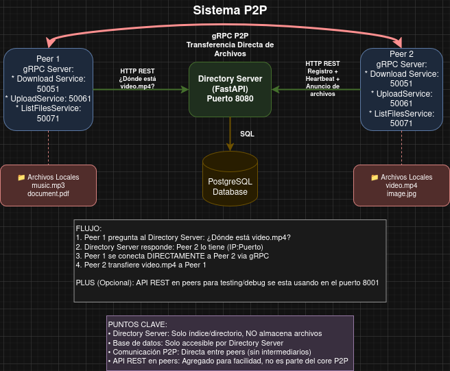
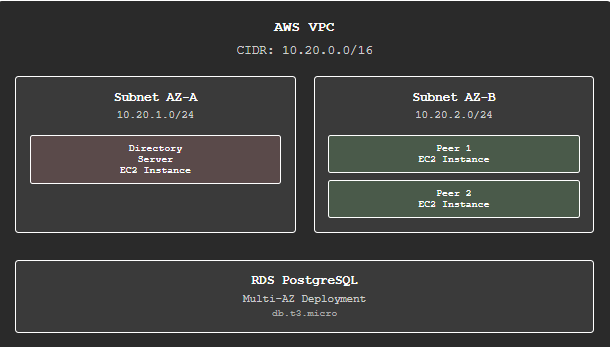

# 🌐 Sistema P2P de Compartición de Archivos


Sistema peer-to-peer (P2P) descentralizado para compartición de archivos con arquitectura híbrida: servidor de directorio centralizado para localización y transferencia directa entre peers mediante gRPC y REST APIs.

## 📚 Índice

- [🎯 Características Principales](#-características-principales)
- [🏗️ Arquitectura del Sistema](#️-arquitectura-del-sistema)
- [🛠️ Stack Tecnológico](#️-stack-tecnológico)
- [📁 Estructura del Proyecto](#-estructura-del-proyecto)
- [🚀 Inicio Rápido](#-inicio-rápido)
- [💻 Uso del Sistema](#-uso-del-sistema)
- [🔧 Configuración](#-configuración)
- [🧪 Testing](#-testing)
- [📊 Monitoreo y Observabilidad](#-monitoreo-y-observabilidad)
- [🚢 Deployment](#-deployment)
  - [Desarrollo Local](#desarrollo-local)
  - [☁️ Producción en AWS](#️-producción-en-aws)
- [🔍 Troubleshooting](#-troubleshooting)
- [🤝 Desarrollo](#-desarrollo)

## 🎯 Características Principales

- **Arquitectura Híbrida**: Directory Server centralizado + transferencia P2P directa
- **APIs REST Completas**: Cada peer expone una API REST para todas las operaciones
- **Microservicios gRPC**: 3 servicios independientes por peer (Download, Upload, List)
- **Transferencia Eficiente**: Streaming de archivos con chunking de 64KB
- **Autenticación JWT**: Seguridad en comunicaciones con Directory Server
- **Auto-registro**: Peers se registran automáticamente al iniciar
- **Heartbeat Automático**: Mantenimiento de estado activo cada 30s
- **Failover**: Recuperación automática y peers de respaldo
- **Observabilidad**: Logs estructurados y métricas de performance

## 🏗️ Arquitectura del Sistema



### Componentes del Sistema

#### 🏢 Directory Server
- **Tecnología**: FastAPI + PostgreSQL 17
- **Puerto**: 8080
- **Función**: Registro de peers, localización de archivos, autenticación JWT
- **Endpoints principales**:
  - `POST /api/v1/peers/register` - Registro de peers
  - `POST /api/v1/auth/login` - Autenticación
  - `GET /api/v1/files/search` - Búsqueda de archivos
  - `POST /api/v1/files/announce` - Anuncio de archivos
  - `POST /api/v1/peers/heartbeat` - Heartbeat

#### 🔗 Peers (Nodos P2P)
Cada peer ejecuta:

**API REST** (Puertos 8001-8004):
- Interface principal para todas las operaciones
- Documentación automática con Swagger/OpenAPI
- Endpoints para upload, download, search, status

**Microservicios gRPC independientes**:
- **Download Service** (50051-50054): Servir archivos a otros peers
- **Upload Service** (50061-50064): Recibir archivos de otros peers  
- **List Service** (50071-50074): Listar archivos disponibles

## 🛠️ Stack Tecnológico

### Backend
- **Python 3.13**: Lenguaje principal
- **FastAPI**: Framework web para APIs REST
- **SQLAlchemy**: ORM para base de datos
- **Uvicorn**: Servidor ASGI

### Base de Datos
- **PostgreSQL 17**: Base de datos relacional
- **psycopg2-binary**: Driver de conexión

### Comunicación
- **gRPC**: Transferencia P2P de archivos (streaming)
- **REST API**: Comunicación con Directory Server e interface de peers
- **Protocol Buffers**: Serialización de mensajes gRPC
- **aiohttp**: Cliente HTTP asíncrono
- **JWT**: Autenticación y autorización

### Containerización
- **Docker**: Containerización de servicios
- **Docker Compose**: Orquestación local
- **Multi-container**: Directory Server + 4 Peers independientes

### Calidad y Testing
- **pytest**: Framework de testing
- **pytest-asyncio**: Tests asíncronos
- **black**: Formateo de código
- **flake8**: Linting
- **structlog**: Logging estructurado

## 📁 Estructura del Proyecto

```
p2p-grpc-rest/
├── docker-compose.yml              # Orquestación de servicios
├── Dockerfile                      # Dockerfile base
├── Dockerfile.dir                  # Directory Server específico
├── Dockerfile.peer                 # Peers específico
├── Pipfile                         # Dependencias Python (pipenv)
├── Pipfile.lock                    # Lock de dependencias
├── src/
│   ├── directory-server/           # Directory Server (FastAPI)
│   │   ├── main.py                 # Punto de entrada
│   │   ├── config.py               # Configuración
│   │   ├── api/v1/                 # Endpoints REST API
│   │   │   ├── routers/
│   │   │   │   ├── auth.py         # Autenticación JWT
│   │   │   │   ├── peers.py        # Gestión de peers
│   │   │   │   └── health.py       # Health checks
│   │   │   └── schemas.py          # Modelos Pydantic
│   │   ├── services/               # Lógica de negocio
│   │   ├── models/                 # Modelos SQLAlchemy
│   │   ├── repositories/           # Acceso a datos
│   │   ├── contextdb/              # Conexión a base de datos
│   │   └── interfaces/             # Interfaces
│   ├── peer/                       # Aplicación Peer
│   │   ├── main.py                 # Punto de entrada (solo API REST)
│   │   ├── core/                   # Configuración y gestión
│   │   │   ├── config.py           # Configuración del peer
│   │   │   ├── peer_manager.py     # Gestor principal
│   │   │   └── logging_config.py   # Configuración de logs
│   │   ├── services/
│   │   │   ├── grpc/               # Microservicios gRPC
│   │   │   │   ├── download_service.py
│   │   │   │   ├── upload_service.py
│   │   │   │   └── list_service.py
│   │   │   └── rest/               # API REST del peer
│   │   │       └── api_server.py   # FastAPI server completo
│   │   └── clients/                # Clientes para comunicación
│   │       ├── grpc/               # Clientes gRPC
│   │       └── rest/               # Cliente REST (Directory Server)
│   ├── proto/                      # Definiciones Protocol Buffers
│   │   ├── file_service.proto      # Definición de servicios gRPC
│   │   └── generate.py             # Generador de código gRPC
│   └── generated/                  # Archivos generados automáticamente
│       ├── file_service_pb2.py
│       └── file_service_pb2_grpc.py
├── configs/                        # Configuraciones de peers
│   ├── peer1.env                   # Configuración Peer 1
│   ├── peer2.env                   # Configuración Peer 2
│   ├── peer3.env                   # Configuración Peer 3
│   └── peer4.env                   # Configuración Peer 4
├── tests/                          # Suite de pruebas
│   ├── unit/                       # Tests unitarios
│   ├── integration/                # Tests de integración
│   └── conftest.py                 # Configuración de pytest
├── infra/                          # Infraestructura como código
│   └── terraform/                  # Scripts de Terraform para AWS
└── data/                           # Directorio de datos de peers
    ├── peer1_files/
    ├── peer2_files/
    ├── peer3_files/
    └── peer4_files/
```

## 🚀 Inicio Rápido

### Prerrequisitos

- **Docker** y **Docker Compose**
- **Python 3.13+** (para desarrollo local)
- **Git** para clonar el repositorio

### Instalación y Ejecución

1. **Clonar el repositorio**
   ```bash
   git clone <repository-url>
   cd p2p-grpc-rest
   ```

2. **Levantar el sistema completo**
   ```bash
   docker-compose up -d
   ```
   
   Esto iniciará:
   - **Directory Server**: Puerto 8080 (FastAPI + PostgreSQL)
   - **Peer 1**: API REST (8001) + gRPC (50051, 50061, 50071)
   - **Peer 2**: API REST (8002) + gRPC (50052, 50062, 50072)
   - **Peer 3**: API REST (8003) + gRPC (50053, 50063, 50073)
   - **Peer 4**: API REST (8004) + gRPC (50054, 50064, 50074)

3. **Verificar que funciona**
   ```bash
   # Health check del directory server
   curl http://localhost:8080/api/v1/health
   
   # Health check de peer1
   curl http://localhost:8001/status
   
   # Ver documentación interactiva del directory server
   open http://localhost:8080/docs
   
   # Ver documentación interactiva de peer1
   open http://localhost:8001/docs
   ```

## 💻 Uso del Sistema

### 🌐 Interface Principal: APIs REST

**No hay CLI** - Toda la interacción se realiza a través de APIs REST con documentación Swagger automática.

#### Directory Server API (Puerto 8080)
```bash
# Ver documentación completa
curl http://localhost:8080/docs

# Endpoints principales
GET  /api/v1/health              # Health check
POST /api/v1/auth/login          # Autenticación
POST /api/v1/peers/register      # Registro de peers
GET  /api/v1/files/search        # Búsqueda de archivos
POST /api/v1/files/announce      # Anuncio de archivos
POST /api/v1/peers/heartbeat     # Heartbeat
```

#### Peer APIs (Puertos 8001-8004)
```bash
# Ver documentación de peer1
curl http://localhost:8001/docs

# Endpoints principales de cada peer
GET  /status                     # Estado del peer
GET  /files/local               # Archivos locales
GET  /files/search              # Buscar en la red P2P
POST /files/download            # Descargar archivo
POST /files/upload              # Subir archivo
POST /files/announce            # Anunciar archivos
POST /register                  # Registrar peer
GET  /peers                     # Ver peers activos
POST /auth/login                # Login manual
POST /auth/logout               # Logout
```

### 🎮 Flujo de Uso Típico

#### 1. Verificar Estado del Sistema
```bash
# Estado del directory server
curl http://localhost:8080/api/v1/health

# Estado de peer1
curl http://localhost:8001/status
```

#### 2. Ver Archivos Locales
```bash
# Listar archivos en peer1
curl http://localhost:8001/files/local
```

#### 3. Subir un Archivo
Aunque este con un endpoint internamente se hace con GRPC, y solo el peer puede subir archivos a si mismo.
```bash
# Subir archivo a peer1 usando form-data
curl -X POST "http://localhost:8001/files/upload" \
  -H "Content-Type: multipart/form-data" \
  -F "file=@/path/to/your/file.txt"
```

#### 4. Buscar Archivos en la Red
```bash
# Buscar archivo específico
curl "http://localhost:8001/files/search?filename=file.txt"
```

#### 5. Descargar Archivo de Otro Peer
```bash
# Descargar archivo encontrado
curl -X POST "http://localhost:8001/files/download" \
  -H "Content-Type: application/json" \
  -d '{"filename": "file.txt"}'
```

#### 6. Ver Peers Activos
```bash
# Ver todos los peers en la red
curl http://localhost:8001/peers
```

### 📱 Documentación Interactiva

Cada servicio expone documentación automática con Swagger UI:

- **Directory Server**: http://localhost:8080/docs
- **Peer 1**: http://localhost:8001/docs
- **Peer 2**: http://localhost:8002/docs
- **Peer 3**: http://localhost:8003/docs
- **Peer 4**: http://localhost:8004/docs

## 🔧 Configuración

### ⚙️ Configuración por Peer

Cada peer tiene su archivo de configuración en `configs/`:

```env
# configs/peer1.env
PEER_NAME=peer_1
PEER_PASSWORD=peer123
PEER_IP=0.0.0.0

# Puertos de microservicios gRPC independientes
GRPC_DOWNLOAD_PORT=50051
GRPC_UPLOAD_PORT=50061
GRPC_LIST_PORT=50071
REST_PORT=8001

# Directorio de archivos
FILES_DIRECTORY=./data/peer1_files

# Directory Server
DIRECTORY_SERVER_URL=http://directory_server:8080/api/v1
HEARTBEAT_INTERVAL=30
LOG_LEVEL=INFO

# Peers amigos para failover
PEER_FRIEND_PRIMARY=http://peer2:8002
PEER_FRIEND_BACKUP=http://peer3:8003
PEER_FRIEND_PRIMARY_GRPC=peer2:50052
PEER_FRIEND_BACKUP_GRPC=peer3:50053
```

### 🐳 Configuración Docker

```yaml
# docker-compose.yml (fragmento)
services:
  directory_server:
    build:
      dockerfile: Dockerfile.dir
    ports:
      - "8080:8080"
    environment:
      DATABASE_URL: postgresql://p2p:unaClav3@db:5432/p2p_db

  peer1:
    build:
      dockerfile: Dockerfile.peer
    ports:
      - "50051:50051"   # gRPC Download
      - "50061:50061"   # gRPC Upload  
      - "50071:50071"   # gRPC List
      - "8001:8001"     # REST API
    env_file:
      - ./configs/peer1.env
```

## 🧪 Testing

### Ejecutar Tests
```bash
# Tests unitarios
docker exec -it peer1 pytest tests/unit/

# Tests de integración
docker exec -it peer1 pytest tests/integration/

# Tests de concurrencia
docker exec -it peer1 pytest tests/integration/test_concurrency_new.py -v
```

### Tests de Concurrencia
El sistema soporta **15+ operaciones simultáneas** por peer:
- Búsquedas de archivos
- Descargas concurrentes
- Operaciones de estado
- Listado de archivos

## 📊 Monitoreo y Observabilidad

### Logs Estructurados
```bash
# Ver logs en tiempo real
docker-compose logs -f

# Logs de servicio específico
docker-compose logs -f peer1
docker-compose logs -f directory_server
```

### Métricas de Performance
- **Tiempo de registro**: < 500ms
- **Búsqueda de archivos**: < 200ms  
- **Transferencia**: ~10MB/s por conexión
- **Concurrencia**: 15+ operaciones simultáneas por peer
- **Heartbeat**: Cada 30 segundos

## 🚢 Deployment

### Desarrollo Local
```bash
# Levantar sistema completo
docker-compose up -d

# Ver logs
docker-compose logs -f

# Parar sistema
docker-compose down
```

### ☁️ Producción en AWS

El sistema incluye una implementación completa en AWS usando **Terraform** como Infrastructure as Code (IaC). La infraestructura despliega automáticamente toda la arquitectura P2P en la nube.

#### 🏗️ Arquitectura AWS



#### 🚀 Deployment Automático

**1. Prerrequisitos**
```bash
# Instalar Terraform
curl -fsSL https://apt.releases.hashicorp.com/gpg | sudo apt-key add -
sudo apt-add-repository "deb [arch=amd64] https://apt.releases.hashicorp.com $(lsb_release -cs) main"
sudo apt-get update && sudo apt-get install terraform

# Configurar AWS CLI
aws configure
# AWS Access Key ID: [tu-access-key]
# AWS Secret Access Key: [tu-secret-key]
# Default region name: us-east-1
# Default output format: json
```

**2. Configuración**
```bash
cd infra/terraform

# Copiar y editar variables
cp terraform.tfvars.example terraform.tfvars
vim terraform.tfvars
```

**Archivo terraform.tfvars:**
```hcl
# Configuración requerida
key_name = "tu-keypair-aws"              # Key pair existente en AWS
git_repo_url = "https://github.com/tu-usuario/p2p-grpc-rest.git"
git_branch = "main"
db_password = "tu-password-seguro"

# Configuración opcional
aws_region = "us-east-1"
peers_count = 2                          # Número de peers (2-4 recomendado)
instance_type_default = "t3.micro"       # Tipo de instancia EC2
vpc_cidr = "10.20.0.0/16"
```

**3. Despliegue**
```bash
# Inicializar Terraform
terraform init

# Planificar deployment
terraform plan

# Aplicar infraestructura
terraform apply
# Confirmar con: yes

# Ver outputs importantes
terraform output
```

#### 📋 Componentes Desplegados

**🖥️ EC2 Instances**
- **Directory Server**: 1 instancia t3.micro
  - AMI: Amazon Linux 2
  - Puertos: 8080 (FastAPI)
  - Auto-deployment con Docker
  - Conexión automática a RDS
  
- **Peers**: 2-4 instancias t3.micro (configurable)
  - AMI: Amazon Linux 2  
  - Puertos por peer: REST (8001+) + gRPC (50051+, 50061+, 50071+)
  - Auto-deployment con Docker
  - Registro automático con Directory Server

**🗄️ RDS PostgreSQL**
- **Engine**: PostgreSQL 16
- **Instance**: db.t3.micro
- **Storage**: 20GB SSD
- **Multi-AZ**: Deshabilitado (demo)
- **Backup**: Deshabilitado (demo)
- **Public Access**: Habilitado para demo

**🌐 Networking**
- **VPC**: 10.20.0.0/16
- **Subnets**: 2 públicas (10.20.1.0/24, 10.20.2.0/24)
- **Internet Gateway**: Para acceso público
- **Route Tables**: Configuradas automáticamente

**🔒 Security Groups**
- **Directory Server SG**:
  - Inbound: 8080 (HTTP), 22 (SSH)
  - Outbound: All traffic
  
- **Peers SG**:
  - Inbound: 8001-8004 (REST), 50051-50074 (gRPC), 22 (SSH)
  - Outbound: All traffic
  
- **RDS SG**:
  - Inbound: 5432 (PostgreSQL) desde EC2 instances
  - Outbound: None

#### 🤖 Scripts de Auto-Deployment

**Directory Server (user_data/directory_server.sh)**
```bash
#!/bin/bash
# 1. Instala Docker y dependencias
# 2. Clona el repositorio del proyecto
# 3. Construye imagen Docker del Directory Server
# 4. Ejecuta contenedor con conexión a RDS
# 5. Espera hasta que el servicio esté listo
# 6. Configura health checks automáticos
```

**Peers (user_data/peer.sh)**
```bash
#!/bin/bash
# 1. Instala Docker y dependencias
# 2. Clona el repositorio del proyecto
# 3. Construye imagen Docker del Peer
# 4. Detecta IP pública automáticamente
# 5. Espera a que Directory Server esté disponible
# 6. Ejecuta contenedor con configuración específica
# 7. Auto-registro con Directory Server
```

#### 🔧 Configuración Avanzada

**Variables Terraform Completas:**
```hcl
# Región y networking
aws_region = "us-east-1"
vpc_cidr = "10.20.0.0/16"
public_subnet_cidrs = ["10.20.1.0/24", "10.20.2.0/24"]

# EC2 Configuration
key_name = "mi-keypair"
instance_type_default = "t3.micro"
peers_count = 3

# Database
db_name = "p2pdb"
db_username = "p2puser"
db_password = "mi-password-seguro"

# Application
git_repo_url = "https://github.com/usuario/p2p-grpc-rest.git"
git_branch = "main"
peer_rest_base_port = 8001
directory_server_port = 8080
```

#### 📊 Monitoreo en AWS

**CloudWatch Logs** (configuración futura):
```bash
# Logs de aplicación se pueden enviar a CloudWatch
# Métricas de EC2 automáticas
# Alarmas para health checks
```

**Acceso a Instancias:**
```bash
# Obtener IPs públicas
terraform output

# SSH a Directory Server
ssh -i ~/.ssh/tu-key.pem ec2-user@<directory-server-ip>

# SSH a Peer
ssh -i ~/.ssh/tu-key.pem ec2-user@<peer-ip>

# Ver logs de contenedores
docker logs directory-server
docker logs p2p-peer
```

#### 🧪 Testing en AWS

**1. Verificar Deployment**
```bash
# Directory Server
curl http://<directory-server-ip>:8080/api/v1/health

# Peer APIs
curl http://<peer1-ip>:8001/status
curl http://<peer2-ip>:8002/status
```

**2. Test Completo P2P**
```bash
# Subir archivo a peer1
curl -X POST "http://<peer1-ip>:8001/files/upload" \
  -F "file=@test-file.txt"

# Buscar archivo desde peer2
curl "http://<peer2-ip>:8002/files/search?filename=test-file.txt"

# Descargar archivo en peer2
curl -X POST "http://<peer2-ip>:8002/files/download" \
  -H "Content-Type: application/json" \
  -d '{"filename": "test-file.txt"}'
```

#### 💰 Costos Estimados (AWS)

**Recursos por mes (us-east-1):**
- **EC2 t3.micro** (3 instancias): ~$25/mes
- **RDS db.t3.micro**: ~$15/mes  
- **EBS Storage** (20GB): ~$2/mes
- **Data Transfer**: ~$1-5/mes
- **Total estimado**: ~$43-47/mes

#### 🗑️ Cleanup

**Destruir infraestructura:**
```bash
cd infra/terraform

# Destruir todos los recursos
terraform destroy
# Confirmar con: yes

# Verificar que no queden recursos
aws ec2 describe-instances --query 'Reservations[].Instances[?State.Name!=`terminated`]'
```

#### 🔐 Consideraciones de Seguridad

**Para Producción (mejoras recomendadas):**
- Usar **VPC privadas** con NAT Gateway
- Implementar **Application Load Balancer**
- Configurar **SSL/TLS** certificates
- Usar **AWS Secrets Manager** para passwords
- Implementar **IAM roles** específicos
- Habilitar **VPC Flow Logs**
- Configurar **CloudTrail** para auditoría

## 🔍 Troubleshooting

### Problemas Comunes

**Peer no se registra:**
```bash
# Verificar directory server
curl http://localhost:8080/api/v1/health

# Verificar logs del peer
docker-compose logs peer1
```

**Descarga falla:**
```bash
# Verificar que el archivo existe
curl "http://localhost:8001/files/search?filename=archivo.txt"

# Verificar estado del peer origen
curl http://localhost:8002/status
```

**Servicios no responden:**
```bash
# Reiniciar servicios
docker-compose restart

# Limpiar y reiniciar
docker-compose down
docker-compose up -d
```

### Comandos Útiles
```bash
# Estado de todos los contenedores
docker-compose ps

# Acceder a shell de peer
docker exec -it peer1 bash

# Ver uso de recursos
docker stats

# Limpiar sistema completo
docker-compose down -v
docker system prune -f
```

## 🤝 Desarrollo

### Setup de Desarrollo Local
```bash
# Instalar dependencias
pipenv install --dev

# Activar entorno virtual
pipenv shell

# Generar código gRPC
python -m src.proto.generate

# Ejecutar tests
pytest tests/
```

### Estructura de Desarrollo
- **FastAPI** para APIs REST con documentación automática
- **gRPC** para comunicación P2P eficiente
- **SQLAlchemy** para ORM y migraciones
- **pytest** para testing completo
- **Docker** para desarrollo consistente

## 📄 Licencia

[Especificar licencia del proyecto]

## 👥 Equipo

Proyecto desarrollado para el curso "Arquitecturas de nube y Sistemas distribuidos"

## 📞 Soporte

Para problemas o preguntas:
- Revisar documentación en APIs: `/docs`
- Consultar logs: `docker-compose logs -f`
- Verificar health checks de servicios

---

**Sistema P2P completamente funcional con APIs REST, microservicios gRPC, y deployment automatizado. Listo para demostración y evaluación académica.**
